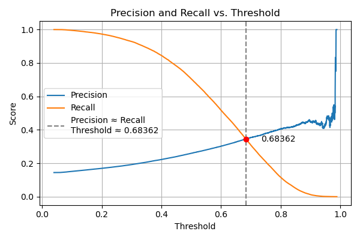
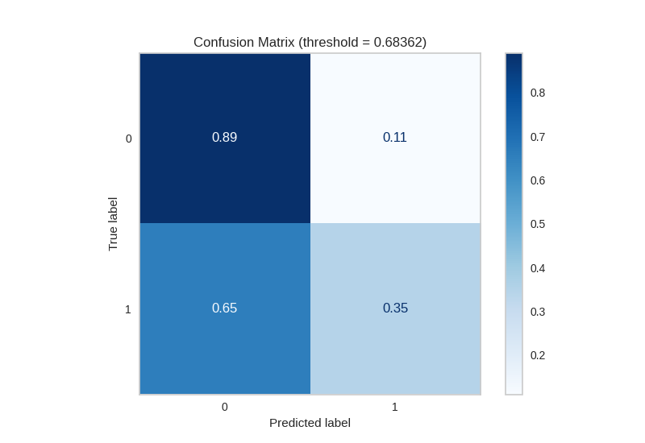

## Model Training & Evaluation Procedure

To ensure proper evaluation and avoid data leakage, the logistic regression model was trained and tested using a clean and reproducible pipeline.

### Data Preparation

- Merged BRFSS data from the years 2019 through 2023.
- Selected only features that were available across all five years.
- Removed rows with missing values in the selected features or the target variable (`diabetes`).
- Encoded binary variables (like `exercise_any`, `smoke_100`, and `diabetes`) as 1 (Yes) and 0 (No).
- Converted categorical variables (such as `sex`, `educa`, and `bmi_cat`) into dummy variables using one-hot encoding.

### Feature and Target Separation

    X = df_common.drop(columns=["diabetes"])
    y = df_common["diabetes"]

### Train-Test Split

Performed an 80/20 train-test split using stratified sampling to preserve class balance:

    from sklearn.model_selection import train_test_split

    X_train, X_test, y_train, y_test = train_test_split(
        X, y, test_size=0.2, stratify=y, random_state=SEED
    )

### Model Training

Trained a logistic regression classifier with balanced class weighting:

    from sklearn.linear_model import LogisticRegression

    model = LogisticRegression(max_iter=1000, class_weight="balanced")
    model.fit(X_train, y_train)

### Evaluation

All model evaluation was performed strictly on the held-out test set:

- `y_pred = model.predict(X_test)` was used for classification metrics and the confusion matrix.
- `y_probs = model.predict_proba(X_test)[:, 1]` was used to generate ROC and Precision-Recall curves.

The following metrics were computed:

    from sklearn.metrics import (
        classification_report,
        precision_recall_curve,
        confusion_matrix,
        roc_curve,
        roc_auc_score,
        average_precision_score
    )

## Threshold Selection

We selected a decision threshold based on the point where precision and recall for the diabetic class were approximately equal. This value was identified from the precision/recall vs. threshold plot:

At threshold = 0.68321:

- Precision = 0.35
- Recall = 0.35
- F1 Score = 0.35
- Accuracy = 0.81

This threshold provides a balanced tradeoff between catching true cases of diabetes (recall) and avoiding false positives (precision). It ensures neither metric dominates the other, which is useful in public health screening contexts where both types of errors carry consequences.

## Precision-Recall Curve and Threshold Selection

To choose a classification threshold, we plotted the precision-recall curve using the predicted probabilities on the test set. This helped visualize the tradeoff between recall (sensitivity) and precision.

Based on the curve, we selected a threshold of 0.68321, which offered a balance between catching diabetic cases (recall) and avoiding false positives (precision).

## Classification Report (Threshold = 0.59285)

<pre> 
Classification Report(Baseline Logistic Regression):
              precision    recall  f1-score   support

           0       0.93      0.66      0.77    315358
           1       0.26      0.71      0.38     53222

    accuracy                           0.67    368580
   macro avg       0.59      0.68      0.58    368580
weighted avg       0.83      0.67      0.72    368580
</pre>

This process ensures a fair and valid estimate of model performance on unseen data and follows best practices for model evaluation.